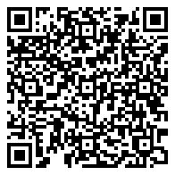

# Safe Exam Browser Playground

## Config examples

### Settings

### Language Exam Settings

Passwords:
* Settingspassword / Exampassword: **settings1234**
* Adminpassword: **admin1234**
* Quitpassword: **quit1234**

